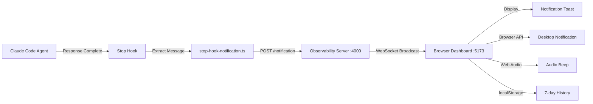

# PAI Codespaces Adapter

Browser-based notification system for Personal AI Infrastructure in headless Linux environments.

## Overview

Personal AI Infrastructure's notification system relies on the voice server (`pai-voice-system`) which uses audio playback. This works great on macOS with native speakers, but fails in headless Linux environments like:

- **GitHub Codespaces** - Cloud-based development containers
- **Remote Servers** - SSH sessions without audio output
- **Docker Containers** - Isolated environments without audio devices
- **WSL (Windows Subsystem for Linux)** - Windows development without Linux audio

**This pack solves that problem** by replacing audio notifications with browser-based notifications through a real-time observability dashboard.

## When to Use This Pack

Use `pai-codespaces-adapter` when:

- You're developing in GitHub Codespaces
- You're working on a remote Linux server via SSH
- You're running Claude Code in a Docker container
- You're using WSL without audio configured
- You want visual notifications alongside (or instead of) audio

**Don't use this pack if:**
- You're on macOS with working audio (use `pai-voice-system` instead)
- You don't need notifications (hooks are optional)

## Architecture

```
Claude Code Agent Response
    ↓
Stop/SubagentStop Hook
    ↓
Extract Message + Emotion Detection
    ↓
HTTP POST to Observability Server (port 4000)
    ↓
WebSocket Broadcast to All Clients
    ↓
Browser Dashboard (port 5173)
    ↓
- Notification Toast (emotion-based styling)
- Desktop Notification (with permission)
- Audio Beep (browser sound)
- 7-day History (localStorage)
```

## Components

### 1. Notification Hooks

**`stop-hook-notification.ts`**
- Triggered when main Claude Code agent finishes responding
- Extracts messages marked with `🗣️ Kai:` or `🎯 COMPLETED:` patterns
- Detects emotion using prosody markers (excited, calm, urgent, etc.)
- Sends notification payload to observability server

**`subagent-stop-hook-notification.ts`**
- Triggered when spawned subagents complete tasks
- Extracts agent name from `[AGENT:name]` tags
- Detects personality based on agent type
- Includes personality field in notification

### 2. Observability Server

**Bun + WebSocket server on port 4000**
- HTTP API endpoints:
  - `POST /notification` - Receive notifications from hooks
  - `GET /health` - Health check
  - `GET /events/recent?limit=100` - Fetch recent events
- WebSocket endpoint:
  - `WS /stream` - Real-time event broadcasting
- Features:
  - Broadcasts to all connected browser clients
  - Watches event files for real-time ingestion
  - In-memory storage (max 1000 events)

### 3. Vue Dashboard (Client)

**Vue 3 + Vite on port 5173**
- Real-time notification toasts in browser
- Emotion-based visual styling:
  - **Calm** - Blue gradient, peaceful emoji
  - **Excited** - Orange gradient, energetic emoji
  - **Urgent** - Red gradient, alert emoji
- Priority-based borders (high/medium/low)
- Desktop notifications (with browser permission)
- Audio beep feedback (Web Audio API)
- 7-day notification history (localStorage)
- WebSocket reconnection with exponential backoff

## Comparison to pai-voice-system

| Feature | pai-voice-system | pai-codespaces-adapter |
|---------|------------------|------------------------|
| **Platform** | macOS (native audio) | Linux/headless environments |
| **Output** | Audio playback via speakers | Browser notifications |
| **TTS** | ElevenLabs API | None (text only) |
| **Requires** | Local audio device | Browser with WebSocket |
| **Real-time** | Yes (~500ms latency) | Yes (<100ms latency) |
| **History** | None | 7-day localStorage |
| **Desktop Notifications** | No | Yes (with permission) |
| **Can coexist** | - | Yes (both can run together) |

## Port Requirements

- **4000** - Observability server (HTTP + WebSocket)
- **5173** - Vite dev server for dashboard (configurable)

In GitHub Codespaces, these ports are automatically forwarded and accessible via HTTPS URLs.

## Features

### Real-Time Notifications
- Instant toast notifications in browser (<100ms)
- WebSocket streaming for zero polling overhead
- Multiple browser tabs supported (all receive notifications)

### Emotion-Based Styling
- Detects 8+ emotions from prosody markers
- Visual theming: calm (blue), excited (orange), urgent (red)
- Priority levels affect border color and auto-dismiss timing

### Desktop Notifications
- Native browser notification API integration
- Click to focus dashboard window
- Persists even when tab backgrounded

### Notification History
- 7-day retention in browser localStorage
- Survives page refresh
- Export as JSON for analysis

### Audio Feedback
- Browser beep sounds (Web Audio API)
- Different tones for different priorities
- No external audio device required

## Installation

See [INSTALL.md](./INSTALL.md) for the full AI-guided installation wizard.

**Quick Start:**
```bash
# 1. Ensure dependencies are installed
# pai-core-install and pai-hook-system required

# 2. Clone PAI repository or download this pack
cd Packs/pai-codespaces-adapter

# 3. Follow INSTALL.md (AI wizard guides you)
# AI will:
# - Check system requirements
# - Ask configuration questions
# - Backup existing files
# - Install hooks and observability system
# - Verify installation
```

## Usage

### Starting the System

**Option 1: Manual Start (Development)**
```bash
# Terminal 1: Start server
bash ~/.claude/observability/scripts/start-server.sh

# Terminal 2: Start client
bash ~/.claude/observability/scripts/start-client.sh
```

**Option 2: Background Start**
```bash
# Start server in background
cd ~/.claude/observability/apps/server && bun run start &

# Start client in background (less common)
cd ~/.claude/observability/apps/client && bun run dev &
```

**Option 3: Codespaces Port Forwarding**
- Codespaces automatically forwards ports 4000 and 5173
- Access dashboard via forwarded HTTPS URL in Codespaces UI
- No manual start needed if configured in devcontainer.json

### Viewing Notifications

1. Open browser to `http://localhost:5173` (or forwarded HTTPS URL)
2. Grant desktop notification permission when prompted
3. Keep dashboard tab open while working
4. Notifications appear automatically when Claude Code responds

### Configuration

**Environment Variables** (in `~/.claude/settings.json`):
```json
{
  "env": {
    "PAI_DIR": "/home/vscode/.claude",
    "DA": "Kai",
    "TIME_ZONE": "America/Toronto",
    "OBSERVABILITY_URL": "http://localhost:4000"
  }
}
```

**Custom Server Port:**
Edit `~/.claude/observability/apps/server/src/index.ts`:
```typescript
const server = Bun.serve({
  port: 4000, // Change this
  // ...
});
```

Update `OBSERVABILITY_URL` in `settings.json` to match.

## Troubleshooting

### Port Conflicts

**Problem:** `EADDRINUSE: address already in use`

**Solution:**
```bash
# Find process using port 4000
lsof -i :4000

# Kill the process
kill -9 <PID>

# Or use a different port (edit server/src/index.ts)
```

### WebSocket Connection Failures

**Problem:** Dashboard shows "Disconnected" status

**Solutions:**
- Check server is running: `curl http://localhost:4000/health`
- Check firewall rules allow port 4000
- In Codespaces, verify port is forwarded (Ports tab)
- Check browser console for error messages

### Desktop Notifications Not Appearing

**Problem:** Browser notifications don't show

**Solutions:**
- Grant permission in browser (click "Allow" when prompted)
- Check browser settings: Site Settings > Notifications > Allowed
- Verify notifications aren't blocked in OS settings
- Try in incognito/private window to test

### Hook Not Triggering

**Problem:** No notifications appear after agent response

**Solutions:**
- Check `~/.claude/settings.json` has hooks registered
- Verify hooks were merged correctly: look for `stop-hook-notification.ts`
- Test hook manually: `bun run ~/.claude/hooks/stop-hook-notification.ts`
- Check hook execution logs in debug output

### Codespaces Port Forwarding

**Problem:** Can't access dashboard in Codespaces

**Solutions:**
- Check Ports tab in Codespaces (bottom panel)
- Verify ports 4000 and 5173 are forwarded
- Use the forwarded HTTPS URL, not localhost
- Make port visibility "Public" if needed

## Architecture Diagram



## FAQ

**Q: Can I use this on macOS?**
A: Yes, but `pai-voice-system` is recommended for Mac (native audio is better). However, you can use both together for dual notifications.

**Q: Does this work with pai-voice-system?**
A: Yes! Both systems can run simultaneously. You'll get audio notifications on Mac and browser notifications in Codespaces.

**Q: How do I change the server port?**
A: Edit `~/.claude/observability/apps/server/src/index.ts` (change port number) and update `OBSERVABILITY_URL` in `~/.claude/settings.json`.

**Q: Can I customize the notification styling?**
A: Yes! Edit `~/.claude/observability/apps/client/src/components/NotificationToast.vue` (Vue component) and `~/.claude/observability/apps/client/tailwind.config.js` (Tailwind CSS).

**Q: How do I uninstall this pack?**
A: Remove the hooks from `~/.claude/settings.json`, delete `~/.claude/hooks/*-notification.ts`, and delete `~/.claude/observability/`. Restore from backup if needed.

**Q: Does this require internet access?**
A: No, the system runs entirely locally (localhost). Only browser access to localhost is needed.

**Q: Can I use this in production?**
A: The system is designed for development environments. For production, consider building the client (`bun run build`) and serving static files, or use a reverse proxy.

## Development

### Project Structure

```
src/
├── hooks/                      # Claude Code hooks
│   ├── stop-hook-notification.ts
│   ├── subagent-stop-hook-notification.ts
│   └── lib/                    # Shared libraries
│       ├── prosody-enhancer.ts  # Emotion detection
│       ├── observability.ts     # Utilities
│       └── metadata-extraction.ts
└── observability/
    ├── apps/
    │   ├── server/              # Bun HTTP + WebSocket server
    │   │   ├── src/
    │   │   │   ├── index.ts     # Main server
    │   │   │   ├── types.ts     # TypeScript interfaces
    │   │   │   └── file-ingest.ts
    │   │   └── package.json
    │   └── client/              # Vue 3 + Vite dashboard
    │       ├── src/
    │       │   ├── App.vue
    │       │   ├── components/
    │       │   │   └── NotificationToast.vue
    │       │   └── composables/
    │       │       └── useNotifications.ts
    │       ├── vite.config.ts
    │       └── package.json
    └── scripts/                 # Management scripts
        ├── start-server.sh
        ├── start-client.sh
        └── install-deps.sh
```

### Tech Stack

**Server:**
- Bun (TypeScript runtime, HTTP, WebSocket)
- No external dependencies

**Client:**
- Vue 3.5+
- Vite 7+ (build tool)
- TailwindCSS 3.4+ (styling)
- lucide-vue-next (icons)

### Contributing

Contributions welcome! Please submit PRs to the main PAI repository with:
- Clear description of changes
- Test results in multiple environments
- Updated documentation

## License

Same license as Personal AI Infrastructure (see main repository).

## Credits

Created by danielmiessler for the Personal AI Infrastructure project.

Adapted from `pai-voice-system` for headless Linux environments.
